# Examen Final de Computación Visual 2026-I

Nombre: Baruj Vladimir Ramírez Escalante
Fecha de entrega: 17/06/2026

## Ejercicio 1 - Procesamiento visual e IA

### Descripción general

Este primer ejercicio implementa, en Python y ejecutándose completamente en local
(sin llamadas a APIs externas ni dependencia de internet en tiempo de
ejecución), un pipeline secuencial de procesamiento clásico de imágenes
compuesto por 6 etapas:

1. Carga de una imagen.
2. Conversión a escala de grises.
3. Conversión a un segundo espacio de color (HSV o LAB).
4. Suavizado (Gaussian Blur).
5. Detección de bordes (Canny o Sobel).
6. Segmentación / detección de objetos, combinando:
   - una técnica clásica (umbralización de Otsu + contornos), y
   - un modelo preentrenado (detector de rostros Haar Cascade / Viola-Jones).

El objetivo es comparar, sobre una misma imagen de entrada, cómo distintas
operaciones clásicas de visión por computador transforman la representación
de los datos antes de llegar a una etapa de "comprensión" más alta como la
segmentación o detección de objetos.

### Dependencias

| Librería | Uso en el proyecto |
|---|---|
| `opencv-python` (cv2) | Carga/guardado de imágenes, conversión de espacio de color, filtros, detección de bordes, umbralización, contornos, Haar Cascade. |
| `numpy` | Manejo de arreglos/máscaras y operaciones matriciales (kernel morfológico, etc.). |
| `matplotlib` | Construcción del panel de comparación final (`comparacion_final.png`). |

Requiere **Python 3.9 o superior**. Todas las dependencias están listadas en
`requirements.txt`.

### Instalación

```bash

# Instalar dependencias
pip install -r requirements.txt
```

### Ejecución

```bash
python pipeline_imagenes.py --image ruta/a/tu_imagen.jpg
```

**Argumentos disponibles:**

| Argumento | Valores | Default | Descripción |
|---|---|---|---|
| `--image` | ruta de archivo (obligatorio) | — | Imagen de entrada a procesar. |
| `--output` | ruta de carpeta | `resultados` | Carpeta donde se guardan todos los resultados. |
| `--colorspace` | `HSV` \| `LAB` | `HSV` | Segundo espacio de color a generar en el paso 3. |
| `--edge` | `canny` \| `sobel` | `canny` | Método de detección de bordes del paso 5. |
| `--blur-ksize` | entero impar | `5` | Tamaño del kernel del Gaussian Blur del paso 4. |

**Ejemplo con todas las opciones:**

```bash
python pipeline_imagenes.py \
  --image fotos/escena.jpg \
  --output resultados_escena \
  --colorspace LAB \
  --edge sobel \
  --blur-ksize 7
```

Al finalizar, la consola imprime el progreso de cada uno de los 7 pasos y la
carpeta indicada en `--output` queda con todos los archivos numerados
(`01_original.png` ... `07_comparacion_final.png`).

### Estructura del ejercicio

```
.
├── src/                    
│   ├── Main.py               # Script principal con las 6 etapas del pipeline
│   └── requirements.txt         # Dependencias del proyecto
└── resultados/                    # Evidencias / capturas usadas en este README
    ├── original.png
    ├── grises.png
    ├── hsv.png
    ├── suavizado.png
    ├── bordes_canny.png
    ├── segmentacion_clasica.png
    ├── deteccion_modelo_preentrenado.png
    └── comparacion_final.png
```

### Evidencias

Resultados obtenidos al ejecutar el pipeline sobre una imagen sintética de
prueba (formas geométricas de color), usada para validar que cada etapa
funciona correctamente antes de probar con imágenes reales:

**1. Imagen original**


**2. Escala de grises**
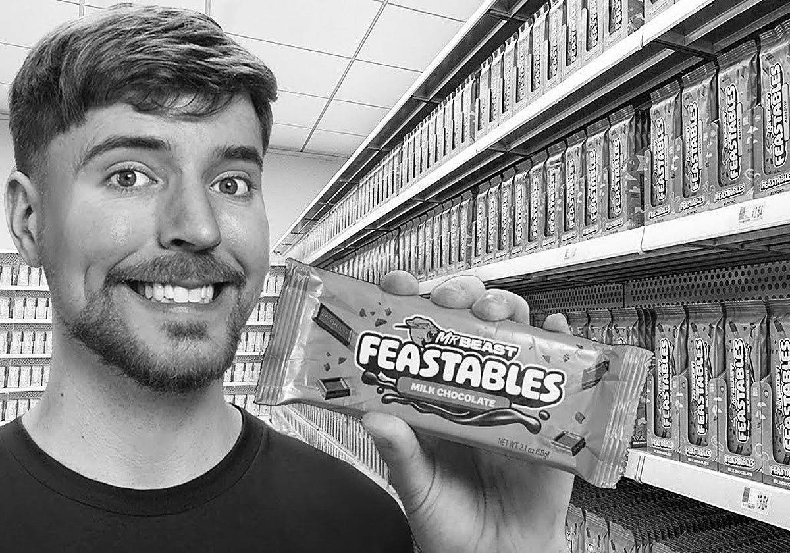

**3. Conversión a HSV**
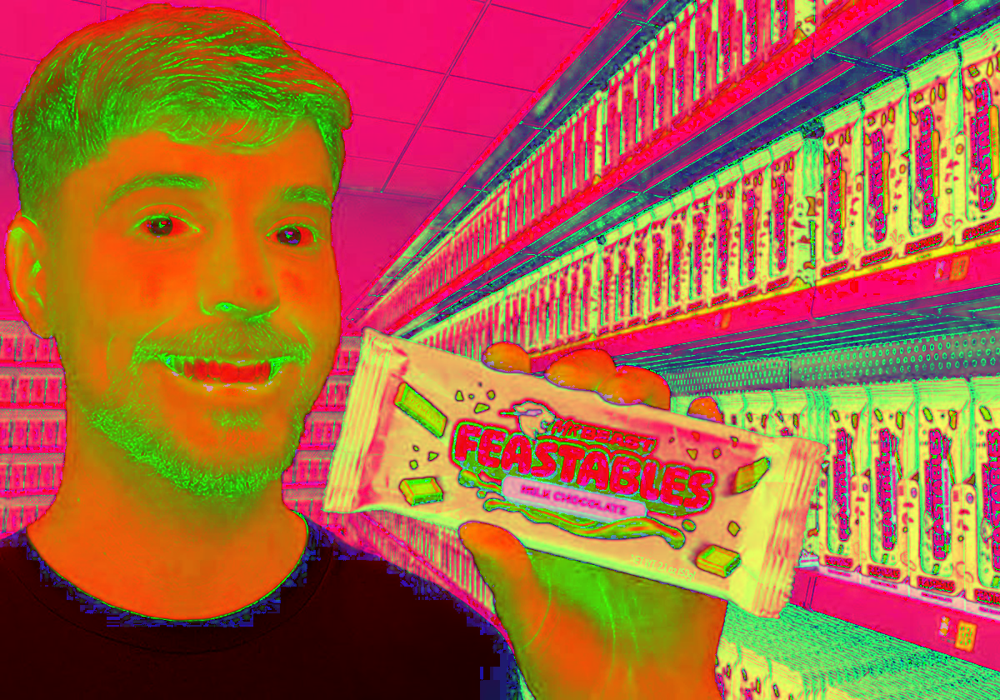

**4. Suavizado (Gaussian Blur)**


**5. Detección de bordes (Canny)**
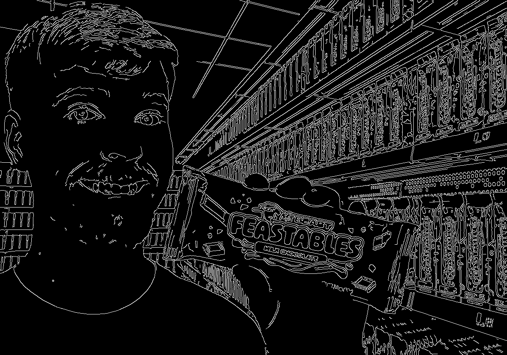

**6a. Segmentación clásica (Otsu + contornos)**
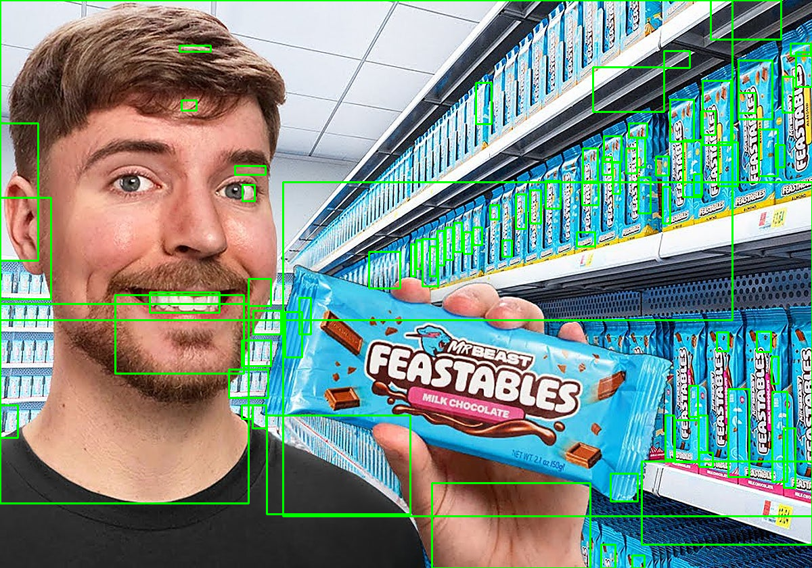

**6b. Detección con modelo preentrenado (Haar Cascade)**
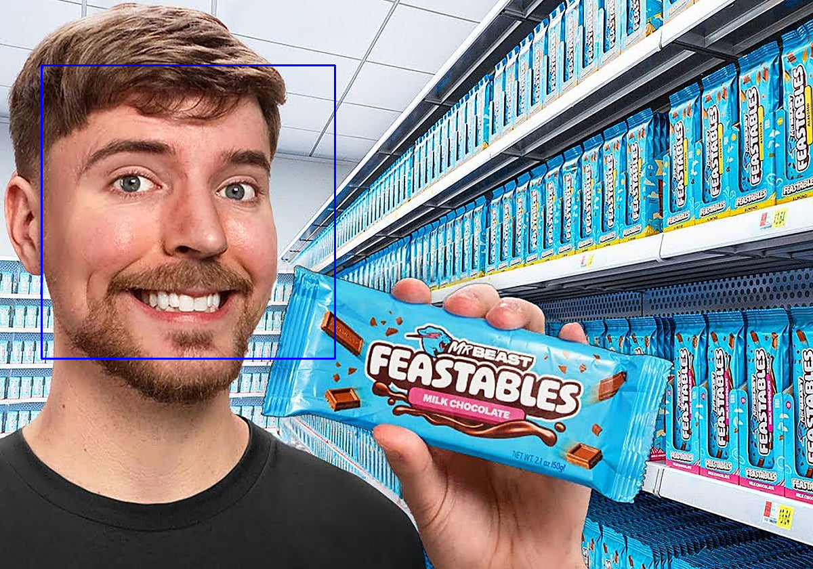


**Comparación final de todas las etapas**
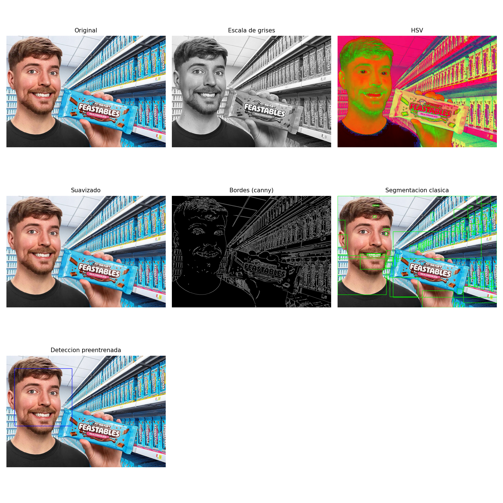


### Análisis técnico

**Arquitectura del código.** El script está organizado como una función pura
por etapa (`load_image`, `to_grayscale`, `to_other_colorspace`,
`apply_smoothing`, `detect_edges`, `segment_classic`,
`detect_objects_pretrained`) más una función `main()` que las orquesta. Esto
se decidió así porque facilita probar, reemplazar o reordenar etapas de forma
aislada (por ejemplo, cambiar Canny por Sobel) sin tocar el resto del
pipeline, y porque hace explícita la correspondencia 1 a 1 entre el enunciado
del ejercicio y el código.

**Espacio de color (paso 3).** Se usa por defecto **HSV** porque desacopla el
tono (Hue) de la intensidad (Value), lo cual hace más intuitivo razonar sobre
el color "puro" de cada objeto independientemente de la iluminación. Se deja
**LAB** como alternativa porque es perceptualmente uniforme (distancias en el
espacio se aproximan a diferencias de color percibidas por el ojo humano),
útil si el ejercicio se extendiera a comparar colores cuantitativamente.

**Suavizado (paso 4).** Se eligió **Gaussian Blur** sobre alternativas como
el filtro de mediana o el filtro bilateral porque es el suavizado estándar
previo a detección de bordes (de hecho, Canny internamente también suaviza
con un kernel gaussiano), tiene un único parámetro intuitivo (tamaño del
kernel) y un costo computacional bajo. El filtro de mediana se descartó por
ser más costoso y pensado para ruido tipo "sal y pimienta"; el bilateral se
descartó por ser más lento y no aportar ventajas relevantes en este caso de
uso académico.

**Detección de bordes (paso 5).** **Canny** se deja como opción por defecto
porque añade supresión de no-máximos e histéresis sobre el gradiente,
entregando bordes delgados y limpios. **Sobel** se mantiene disponible porque
expone directamente la magnitud del gradiente sin post-procesamiento,
sirviendo como punto de comparación didáctico de "antes/después" del
refinamiento que aplica Canny.

**Segmentación clásica (paso 6a).** Se usa **umbralización de Otsu**
(`cv2.THRESH_OTSU`) en vez de un umbral fijo manual porque calcula
automáticamente el punto de corte óptimo a partir del histograma de la
imagen, haciendo el pipeline más robusto frente a distintas imágenes de
entrada sin necesidad de recalibrar parámetros. Se aplica una **apertura
morfológica** (`MORPH_OPEN`) antes de buscar contornos para eliminar ruido
pequeño que de otra forma generaría falsos positivos, y se filtran contornos
por área mínima (`> 200` px) por la misma razón.

**Modelo preentrenado (paso 6b).** Se eligió el detector de rostros **Haar
Cascade / Viola-Jones** (`haarcascade_frontalface_default.xml`) porque viene
incluido en la instalación de `opencv-python` (`cv2.data.haarcascades`), lo
que permite cumplir el requisito de "modelo preentrenado" sin depender de
descargar pesos adicionales ni de conexión a internet, manteniendo el
ejercicio 100% reproducible en local. La limitación evidente es que solo
detecta rostros; si la imagen de entrada no contiene personas , el resultado será 0 detecciones,
lo cual es el comportamiento esperado y no un error. Como mejora futura, esta
función podría reemplazarse por un detector más general basado en una red
preentrenada (por ejemplo MobileNet-SSD o YOLO vía `cv2.dnn`), a costa de
requerir la descarga de un archivo de pesos.

**Comparación final.** Se generó con `matplotlib` en lugar de, por
ejemplo, concatenar las imágenes manualmente con `numpy`, porque permite
añadir títulos a cada subimagen y controlar el layout en una grilla de forma
sencilla, resultando en una salida más legible para fines de documentación y
evaluación.

**Limitaciones generales.** El pipeline asume una sola imagen por ejecución
(no procesa lotes/carpetas), y los umbrales de Canny (100/200) están fijos en
el código; en una versión futura podrían exponerse como argumentos de línea
de comandos igual que `--blur-ksize`.

### Uso de IA

Este ejercicio se desarrolló con asistencia de **Claude
(Anthropic)** como copiloto de programación y documentación. Concretamente,
la IA se usó para:

- Proponer la arquitectura modular del script (una función por etapa) a
  partir de los 6 pasos definidos por el estudiante.
- Escribir el código base de cada función (conversión de espacio de color,
  suavizado, bordes, segmentación clásica, detección con Haar Cascade) y sus
  comentarios/docstrings.
- Redactar y estructurar este documento (README), incluyendo la
  justificación técnica de cada decisión de diseño.

Las decisiones de **qué pasos debía incluir el ejercicio**, los **parámetros
por defecto a usar** y la **validación final de los resultados** fueron
definidas y revisadas por el estudiante.

### Dificultades

Principalmente la segmentación clásica no definio objetos de forma concreta, apareciendo multiples cuadrados los cuales parecen casi aleatorios. Por otro lado el modelo preendtrenado utulizado solo identifica rostros.

## Ejercicio 2 - Escena 3D interactiva temática

### Descripción general

Este ejercicio buscó integrar en una escena de *Unity 3D* diferentes elementos vistos en clase como son jerarquía de objetos, transformaciones, materiales, iluminación, animaciones e interacción.

Todo esto bajo una temática de entorno futurista simple, la cual integra una base futurista con un robot atrapado en un campo de fuerza.

Para lograr la escena se requirió de un **controlador** de la cámara por medio del usuario; un **sistema de interacciones** que intenta interactuar con cualquier objeto que implemente una interfaz declarada; un **shader** de campo de fuerza, así como su correspondiente material; **iluminación** dentro de la escena junto con un skybox oscuro; y una **Animación** que realiza el robot al interactuar con el campo de fuerza que lo mantiene contenido.

### Dependencias

Se realizó el ejercicio en el motor de Unity en una escena 3D con el pipeline de URP.

Adicionalmente se usaron los siguientes assets:

Robot - <https://assetstore.unity.com/packages/3d/characters/robots/robot-kyle-urp-4696>

Assets modulares para escena - <https://assetstore.unity.com/packages/3d/environments/3d-free-modular-kit-85732>

Skybox - <https://assetstore.unity.com/packages/2d/textures-materials/sky/allsky-free-10-sky-skybox-set-146014>

### Ejecución

No hay un ejecutable del ejercicio, por lo que se requiere probar dentro del motor de Unity

### Estructura del ejercicio

```
.
├── proyecto_unity/           # Implementación en unity
└── media/                    # Evidencias / capturas usadas en este README
    ├── Escenario.png
    ├── Organizacion.png
    ├── Estructura.png
    ├── Director.png
    ├── AnimatorController.png
    └── demo.png
```

### Evidencias

Como se mencionó anteriormente, el escenario se contruyó utilizando un packete de assets modulares, que conectaban con ayuda del *grid snapping* de Unity, sin embargo no todas las piezas encajan con cualquier otra, por lo que en algunas secciones se requirió mover manualmente algunas de las piezas para que no se sobreponieran unas sobre otras causando artefactos visuales.

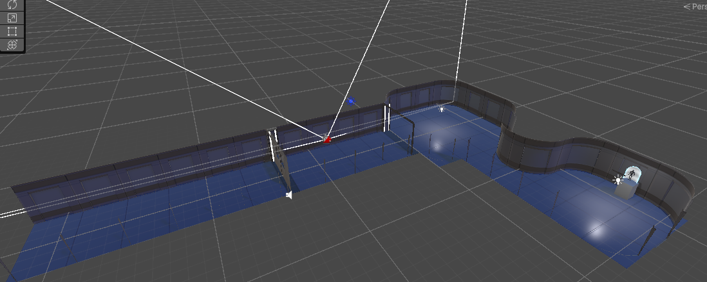

La escena dentro de Unity se organizó de tal manera que quedara organizada, esto haciendo uso de las jerarquías,

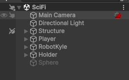

lo cual fue particularmente útil para poder evitar seleccionar todos los elementos correspondientes a la estructura o a secciones de esta mientras se trabajaba en otros aspectos.

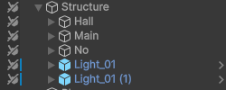

En cuanto al funcionamiento de la animación principal de la escena, el usuario se acerca al robot e interactúa por medio de la tecla **E**, este contiene un script que inicializa con un retraso un *trigger* en el controlador de animaciones del robot, a la vez que reproduce ciertas transformaciones guardadas en un director presente en el mismo objeto, el cual dará el efecto de desactivación al encoger el objeto del campo de fuerza a la vez que le realiza una pequña traslación. Adicionalmente se le aplica una rotación a la base del "pedestal".

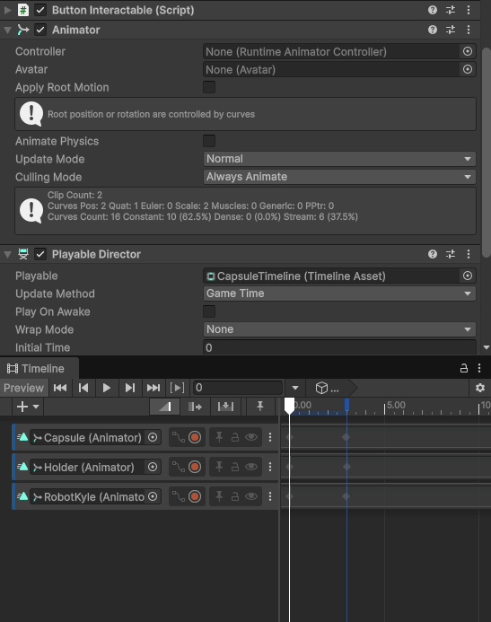

Al accionar el trigger del controlador modificado, este realiza varias animaciones de forma sucesiva de saltar, caer y aterrizar, para dar la impresión de que está celebrando. El controlador estaba originalmente pensado para un personaje jugable, sin embargo por medio de la eliminacion de algunas transiciones y el añadido del trigger se consigue la secuencia deseada accionada por la interacción del usuario.

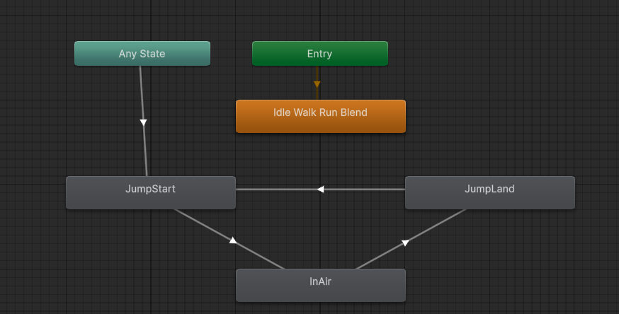

Finalmente, la secuencia completa de los eventos de la escena se muestra en el siguiente GIF:


### Análisis técnico

#### Controlador de Jugador e Interacción

Se implementó un controlador de jugador en primera persona utilizando el componente `CharacterController` de Unity. El script gestiona el movimiento mediante las entradas de teclado (`W`, `A`, `S`, `D`), aplicando desplazamientos relativos a la orientación actual del personaje. También incorpora un sistema de gravedad y salto, permitiendo un comportamiento consistente en entornos tridimensionales.

Para el control de la cámara, se utiliza un objeto pivote asociado a la cabeza del jugador. El movimiento horizontal del ratón rota el personaje sobre el eje Y, mientras que el movimiento vertical modifica la rotación local del pivote, limitando el ángulo de visión para evitar giros excesivos. Este enfoque permite obtener una experiencia de cámara en primera persona estable y natural.

La interacción con objetos se realiza mediante un raycast proyectado desde la cámara en la dirección de visión del jugador. Cuando se presiona la tecla **E**, el sistema verifica si existe un objeto interactuable dentro de una distancia determinada. Para desacoplar la lógica de interacción de los objetos específicos, se implementó una interfaz `IInteractable`, permitiendo que cualquier objeto pueda responder a la interacción siempre que implemente dicho contrato.

#### Sistema de Botones Interactuables

Se desarrolló un sistema de botones interactuables basado en la interfaz `IInteractable`. Cuando el jugador interactúa con un botón mediante el sistema de raycast, el método `Interact()` es ejecutado automáticamente.

El comportamiento del botón se implementó utilizando `UnityEvent`, permitiendo configurar acciones desde el Inspector sin necesidad de modificar el código fuente. Esta aproximación facilita la reutilización del componente y mejora la modularidad del proyecto, ya que un mismo botón puede activar distintos elementos del escenario, como puertas, luces, sonidos o eventos del gestor principal del juego.

Adicionalmente, el botón reproduce una animación mediante un componente `Animator`, proporcionando retroalimentación visual al usuario. La combinación de animaciones y eventos desacoplados permite construir sistemas interactivos flexibles y fácilmente escalables dentro del entorno de Unity.

#### Shader de Campo de Fuerza (`ForceField.shader`)

Shader transparente desarrollado en HLSL para Unity URP, destinado a representar un campo de fuerza o barrera de contención alrededor de un objeto. Combina iluminación de borde (*fresnel*), distorsión animada de vértices y un patrón de energía interna procedural, sin requerir texturas externas.

*Técnicas implementadas:*

1. **Fresnel rim lighting**: el brillo del material aumenta en las zonas donde la normal de la superficie es perpendicular a la cámara, resaltando el contorno del objeto — el efecto característico de un "escudo" o burbuja de energía.
2. **Desplazamiento de vértices (ondulación)**: cada vértice se desplaza a lo largo de su normal según una función senoidal animada en el tiempo, generando una ligera deformación de la superficie sin necesidad de un mapa de desplazamiento.
3. **Ruido procedural 2D**: una función de ruido tipo Perlin, generada por *hashing* (sin muestreo de texturas), modula tanto el color como la opacidad para simular fluctuaciones de energía interna.
4. **Líneas de energía (scanlines)**: un patrón senoidal adicional se desplaza verticalmente sobre la superficie, reforzando la lectura visual de "campo activo".
5. **Renderizado en dos pasadas (doble cara)**: en lugar de `Cull Off`, el shader define dos *passes* independientes (`Cull Front` y `Cull Back`), permitiendo que tanto la cara interior como la exterior del mesh se rendericen con el orden de transparencia correcto. Esto es lo que permite ver el objeto contenido a través de la geometría del campo de fuerza desde cualquier ángulo.

*Parámetros expuestos:*

| Propiedad | Función | Rango |
|---|---|---|
| `_BaseColor` / `_EdgeColor` | Color base y color de borde (fresnel) | Color |
| `_FresnelPower` / `_FresnelIntensity` | Forma e intensidad del brillo de borde | 0.1–8 / 0–5 |
| `_WaveAmplitude` / `_WaveFrequency` / `_WaveSpeed` | Control de la ondulación geométrica | — |
| `_NoiseScale` / `_NoiseSpeed` / `_DistortionStrength` | Escala, velocidad y peso del ruido de energía interna | — |
| `_ScanlineFrequency` / `_ScanlineSpeed` / `_ScanlineIntensity` | Control de las líneas de energía animadas | — |
| `_AlphaBase` | Transparencia base del material en reposo | 0–1 |

*Consideraciones de rendimiento:*

- El renderizado en dos pasadas duplica el costo del *fragment shader* respecto a una sola pasada con `Cull Off`; aceptable para un número reducido de instancias (ej. un único campo de fuerza en escena), pero debe evaluarse si se usa en múltiples objetos simultáneos.
- El ruido procedural evita el costo de muestreo de texturas, a cambio de un cálculo aritmético ligeramente mayor por píxel.
- `ZWrite Off` es necesario para la transparencia, pero puede producir artefactos de orden (*sorting*) si se superponen varios objetos transparentes en la misma zona de la escena.

*Limitaciones conocidas:*

- No reacciona a la iluminación de la escena (es un shader de tipo *unlit* con iluminación simulada vía fresnel), por lo que su aspecto es consistente independientemente de las luces presentes.
- El orden de transparencia entre múltiples campos de fuerza superpuestos no está garantizado y puede requerir ajuste manual del *Render Queue* por instancia.

### Uso de IA

El ejercicio se realizó con asistencia de *Claude* para la generación del shader, así como para la redacción del analisis técnico del mismo. Por otro lado se utilizó ayuda de *ChatGPT* para la generación del script del control de la cámara y el interactuable, así como su análisis técnico.

### Dificultades

La generación del script de control de cámara en primera persona llevo algunas iteraciones, el correcto posicionamiento de los módulos para la construcción del escenario fue demorado mientras entendía como encajaban las piezas entre sí. Aunque ahorro tiempo el utilizar el prefab del robot, igualmente tocó hacerle ajustes en los elementos para que no causara conflicto con el controlador creado para la cámara al igual que la ya mencionada modificación del AnimationController, el cual causa algunos errores menores que no afectaron a la ejecución. 