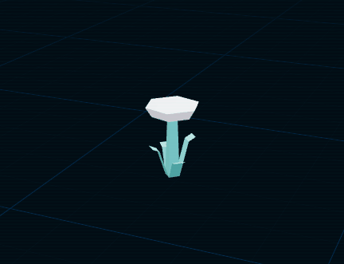
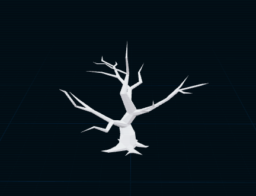
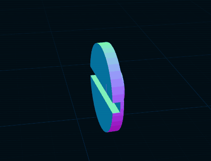
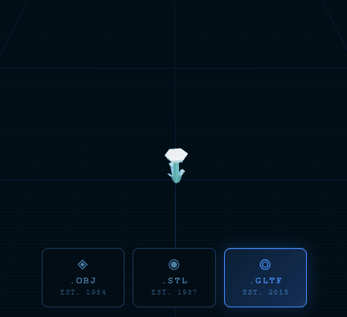
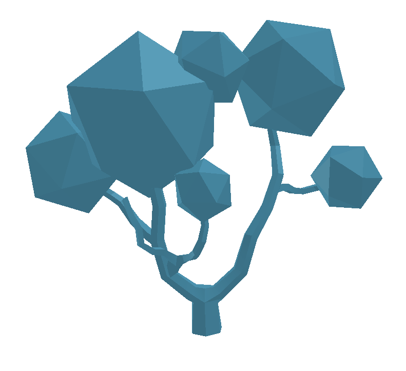
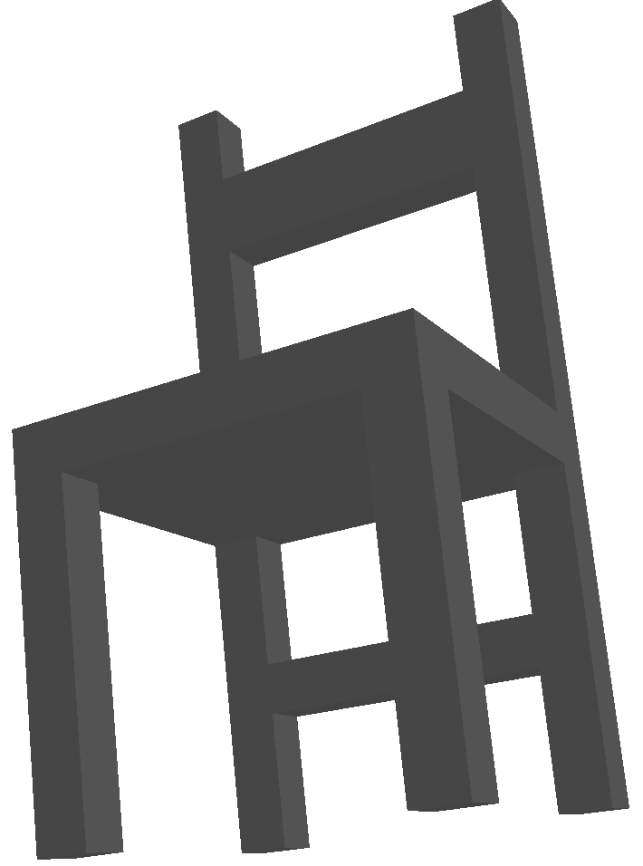
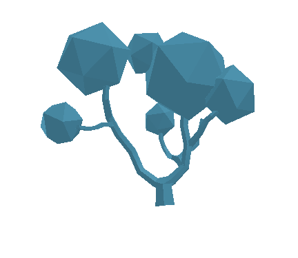
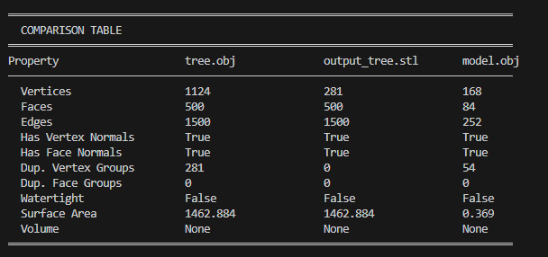

# Importando el Mundo: Visualización y Conversión de Formatos 3D

Baruj Vladimir Ramírez Escalante
Fecha de entrega: 21/02/2026
Descripción breve: Se busca comparar y convertir entre los distintos formatos de modelos 3D: .OBJ, .STL Y .GLTF. Para esto se desarrolló un código en python para la conversión de formatos y una aplicación en React (Tree.js) para la visualización.

**Implementaciones:**

- **Three.js**: Esta aplicación se encarga de visualizar 3 objetos 3D de formatos .OBJ, .STL, .GLB(GLTF binario) y poder cambiar entre ellos mediante una interfaz.
- **Python**: El código de python tiene como principal función convertir formatos de modelos 3D, como funciones secundarias, permite la visualizacion de los modelos cargados y la comparación entre algunas caracteríasticas como vertices, caras, normales y duplicados.

**Resultados visuales:**

- **Three.js**:
La aplicación carga el modelo .GLB de una flor,

también carga el modelo .OBJ de un árbol,

también carga el modelo .STL de un disco.

Finalmente permite el intercambio entre los modelos

- **Python**:
Modelo del árbol de tree.obj y output_tree.stl visualizado gracias al código:

Modelo de la silla de model.obj visualizado gracias al código:

Ambos modelos compartiendo un mismo espacio generado por el código:

Tabla de comparación entre los modelos (notese que a pesar de que tree.obj y output_tree.stl son el mismo modelo, estos cuentan con distinto numero de elementos por el formato):


**Código relevante:**

- **Three.js**:

Código para la carga del modelo .obj:

```plaintext
function OBJModel({ onMetadata }) {
  const mesh = useRef();
  const obj = useLoader(OBJLoader, "/models/model.obj");

  useEffect(() => {
    let vertexCount = 0;
    obj.traverse((child) => {
      if (child.isMesh) {
        vertexCount += child.geometry.attributes.position.count;
      }
    });
    onMetadata({
      format: "OBJ",
      vertices: vertexCount,
      indexed: false,
      description: "Wavefront OBJ — flat-shaded, Phong material",
      smoothness: "Faceted",
      material: "Phong / Lambert",
      textures: "MTL file (if present)",
    });
  }, [obj]);

  useFrame((state) => {
    if (mesh.current) mesh.current.rotation.y = state.clock.elapsedTime * 0.3;
  });

  return <primitive ref={mesh} object={obj} />;
}
```

Código para la carga del modelo .stl:

```plaintext
function STLModel({ onMetadata }) {
  const mesh = useRef();
  const geo = useLoader(STLLoader, "/models/model.stl");

  useEffect(() => {
    geo.computeVertexNormals();
    onMetadata({
      format: "STL",
      vertices: geo.attributes.position.count,
      indexed: geo.index !== null,
      description: "STL — binary mesh, pure geometry, no materials",
      smoothness: "Smooth normals (computed)",
      material: "MeshNormal / Solid",
      textures: "None",
    });
  }, [geo]);

  useFrame((state) => {
    if (mesh.current) mesh.current.rotation.y = state.clock.elapsedTime * 0.4;
  });

  return (
    <mesh ref={mesh} geometry={geo} castShadow>
      <meshNormalMaterial />
    </mesh>
  );
}    
```

Código para la carga del modelo .glb:

```plaintext
function GLTFModel({ onMetadata }) {
  const mesh = useRef();
  const { scene } = useGLTF("/models/model.glb");

  useEffect(() => {
    let vertexCount = 0;
    scene.traverse((child) => {
      if (child.isMesh) {
        vertexCount += child.geometry.attributes.position.count;
      }
    });
    onMetadata({
      format: "GLTF",
      vertices: vertexCount,
      indexed: true,
      description: "GLTF — PBR materials, tangents, UVs, animations",
      smoothness: "Smooth (interpolated normals)",
      material: "PBR / Physically-Based",
      textures: "Albedo, Normal, Roughness, Metalness",
    });
  }, [scene]);

  useFrame((state) => {
    if (mesh.current) mesh.current.rotation.y = state.clock.elapsedTime * 0.25;
  });

  return <primitive ref={mesh} object={scene} />;
}    
```

- **Python**:
Función para la conversión entre los formatos:

```plaintext
def convert_mesh(info: dict, output_path: str):
    """Convert a loaded mesh to another format."""
    mesh = info["mesh"]
    out = Path(output_path)
    ext = out.suffix.lower()

    if ext not in FORMAT_EXPORTERS:
        raise ValueError(
            f"Unsupported output format '{ext}'. "
            f"Supported: {list(FORMAT_EXPORTERS.keys())}"
        )

    exporter = FORMAT_EXPORTERS[ext]

    # Use trimesh.exchange to export
    if ext == ".gltf":
        data = trimesh.exchange.gltf.export_gltf(mesh)
        # data is a dict of filename->bytes; save the .gltf part
        for filename, content in data.items():
            save_path = out.parent / filename
            save_path.write_bytes(content)
            print(f"  Saved: {save_path}")
    elif ext == ".glb":
        data = trimesh.exchange.gltf.export_glb(mesh)
        out.write_bytes(data)
        print(f"  Saved: {out}")
    elif ext == ".obj":
        data = trimesh.exchange.obj.export_obj(mesh)
        out.write_text(data if isinstance(data, str) else data.decode())
        print(f"  Saved: {out}")
    elif ext == ".stl":
        data = trimesh.exchange.stl.export_stl(mesh)
        out.write_bytes(data)
        print(f"  Saved: {out}")
    elif ext == ".ply":
        data = trimesh.exchange.ply.export_ply(mesh)
        out.write_bytes(data)
        print(f"  Saved: {out}")
    else:
        # Fallback to trimesh generic export
        mesh.export(str(out))
        print(f"  Saved: {out}")
```

Diccionario que guarda la información de los modelos para posteriormente construir los reportes:

```plaintext
    info = {
        "file": str(filepath),
        "format": Path(filepath).suffix.lower(),
        "vertices": len(mesh.vertices),
        "faces": len(mesh.faces),
        "edges": len(mesh.edges),
        "has_vertex_normals": has_vertex_normals,
        "has_face_normals": has_face_normals,
        "num_vertex_normals": len(mesh.vertex_normals) if has_vertex_normals else 0,
        "num_face_normals": len(mesh.face_normals) if has_face_normals else 0,
        "duplicate_vertex_groups": len(dup_verts),
        "total_duplicate_vertices": sum(len(g) - 1 for g in dup_verts),
        "duplicate_face_groups": len(dup_faces),
        "total_duplicate_faces": sum(len(g) - 1 for g in dup_faces),
        "is_watertight": mesh.is_watertight,
        "is_volume": mesh.is_volume,
        "euler_number": mesh.euler_number,
        "surface_area": float(mesh.area),
        "volume": float(mesh.volume) if mesh.is_volume else None,
        "bounds_min": bounds[0].tolist(),
        "bounds_max": bounds[1].tolist(),
        "center_mass": mesh.center_mass.tolist(),
        "mesh": mesh,  # keep reference for viz/conversion
    }
```

**Prompts utilizados:**

- **Three.js**: El prompt inicial para la generación de la app en Claude fue: *Hi, Using Three.js with React Three Fiber, load three converted models (.OBJ, .STL, and .GLTF) into a single scene and implement a UI with buttons or selectors to toggle between them. The application should allow for a direct comparison of rendering differences, specifically regarding smoothness, materials, and textures, while incorporating OrbitControls for interactive exploration. As a bonus, display model metadata on-screen, including the specific file format and total vertex count for the active model. Could you help me?*

- **Python**: El prompt para la generación del código en Claude fue: *Hi, I need to create a python code that given models in formats .OBJ, .STL, and .GLTF, compares amount of vertices, faces, normals and if there are duplicates. Also I must be able to visualize each model and their properties. Finally convert between formats using "trimesh.exchange" or assimp. Could you assist me?*

**Aprendizajes y dificultades:**
Se pudo apreciar como mismos modelos pero distintos modelos pueden contener distinta información. Se me dificultó el manejo de archivos en python, pero particularmente se me dificultó mucho la creación del proyecto en React y la posterior solución de problemas con la importación de dependencias para el funcionamiento de la aplicación.
