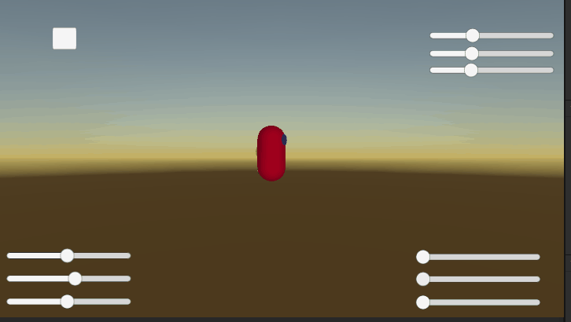
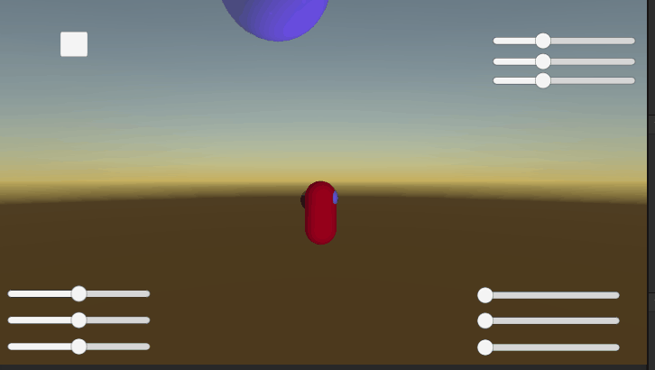
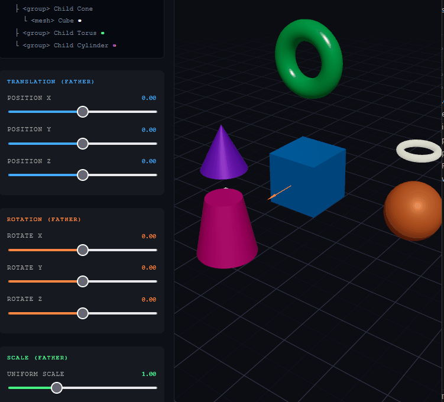

# Jerarquías y Transformaciones: El Árbol del Movimiento

Baruj Vladimir Ramírez Escalante
Fecha de entrega: 21/02/2026
Descripción breve: Este taller busca ver las jerarquian entre objetos y como las transformaciones afectas a hijos padres de otro nodo, se utilizo Three.js y Unity

**Implementaciones:**

- **Unity**: El proyecto de unity involucra una escena en la que un objeto capsula tiene varias esferas al rededor de esta misma. Se puede modificar las distintas tranformaciones del objeto padre por medio de sliders y dispone de un boton para rotación automática.
- **Three.js**: La aplicación de Three.js ubica varias figuras en un espacio, la cual una de el objeto padre. Similar al de Unity, se pueden usar los sliders para aplicar transformaciones al objeto y en consecuencia a los hijos.

**Resultados visuales:**

- **Unity**:
Se puede apreciar como las transformaciones que se le aplican al padre también modifica a los objetos hijos por medio de los distintos sliders.

El botón de rotación automática oculta los sliders y rota al objeto padre.

Se genera un mensaje con los valores del objeto cada vez que se modifica un slider.

- **Three.js**:
En la imagen se puede apreciar como los slider modifican al objeto padre con distintas transformaciones que también modifican a los hijos.


**Código relevante:**

- **Unity**:
Cada tipo de slider llama a una funcion según lo que esté transformando para la impresion de los valores y modificación del objeto

```plaintext
    public void UpdatePosition()
    {
        Vector3 newPosition = new Vector3(posX.value, posY.value, posZ.value);
        target.position = newPosition;
        PrintTransformValues();
    }

    public void UpdateRotation()
    {
        Vector3 newRotation = new Vector3(rotX.value, rotY.value, rotZ.value);
        target.rotation = Quaternion.Euler(newRotation);
        PrintTransformValues();
    }

    public void UpdateScale()
    {
        Vector3 newScale = new Vector3(scaleX.value, scaleY.value, scaleZ.value);
        target.localScale = newScale;
        PrintTransformValues();
    }
```

El objeto rota solo si se presionó el botón de auto rotar

```plaintext
    private void Update()
    {
        if (target == null) return;

        if (autoMoveActive)
        {
            target.Rotate(Vector3.up * autoMoveSpeed * Time.deltaTime);
            PrintTransformValues();
        }
    }
```

- **Three.js**:
Se crea un grupo para que un objeto sea el objeto padre

```plaintext
      <group
        ref={groupRef}
        position={[parent.px, parent.py, parent.pz]}
        rotation={[parent.rx, parent.ry, parent.rz]}
        scale={parent.scale}
      >
        {/* Father mesh – central cube */}
        <mesh castShadow receiveShadow>
          <boxGeometry args={[1, 1, 1]} />
          <meshStandardMaterial color="#4af" metalness={0.4} roughness={0.3} />
        </mesh>
        ...
```

Se añaden hijos al grupo para ver las transformaciones

```plaintext
        {/* ── CHILD 1 – sphere (right) ── */}
        <group position={[2.2, 0, 0]}>
          <mesh castShadow>
            <sphereGeometry args={[0.5, 32, 32]} />
            <meshStandardMaterial color="#f84" metalness={0.2} roughness={0.5} />
          </mesh>
          {/* grandchild – tiny ring */}
          <mesh position={[0, 1.1, 0]} rotation={[Math.PI / 2, 0, 0]}>
            <torusGeometry args={[0.3, 0.06, 16, 40]} />
            <meshStandardMaterial color="#ffd" emissive="#ffd" emissiveIntensity={0.3} />
          </mesh>
        </group>
```

**Prompts utilizados:**

- **Unity**: Se utilizó el siguiente prompt en ChatGPT para la generación del código de Unity: *Hola, necesito crear un script de Unity para unos sliders que me permita aplicar transformaciones (posición, rotación y escala) de un objeto e imprimir los valores de estas transformaciones en consola. Adicionalmente necesito un botón para reiniciar la posición del objeto y otro para que se mueva automáticamente. Me puedes ayudar?*

- **Three.js**: Se utilizó el siguiente prompt en Claude para la generación del código de Three.js: *Hello, I need to create a project with react and three fiber that creates an structure father-son using "group" and other "mesh" objects. Then I need to apply transformations to the father node and be able to observe the behaviour of the children. The rotation and movement must be controlled by sliders in real time. Could you help me with this task?*

**Aprendizajes y dificultades:**
Se pudo apreciar como las transformaciones a objetos padre tambien aplican a los hijos y como se realiza dicha relación tanto en Unity como en una aplicación con Three.js
