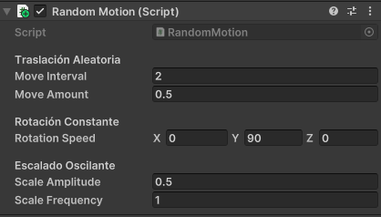
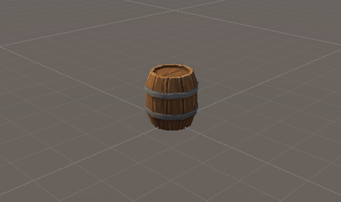
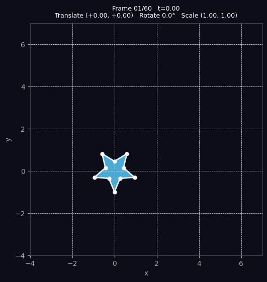

# Transformaciones Básicas en Computación Visual

Baruj Vladimir Ramírez Escalante
Fecha de entrega: 21/02/2026
Descripción breve: Se quieren explorar los conceptos de transformaciones geométricas en este caso en Unity, Python y processing, para cada uno se realizó su respectivo codigó el cual cada uno tuvo como resultado una animación distinta.

**Implementaciones:**

- **Unity**: El código de Unity mueve, rota y escala un objeto que en la escena de ejemplo es un barril. El traslado lo realiza en direcciones aleatorias del eje X y Y a un intervalo y paso especificados desde el editor. La rotación es con respecto al tiempo y el escalado es con respecto a una función sinusoidal con respecto al tiempo.
- **Python**: El código de python aplica traslación, rotación y escala usando matrices de transformación a una figura (En este caso una estrella) y genera un GIF en base a esto.
- **Processing**: El código de procesing realiza translación, rotación y escala a unas "casas", Las transformaciones de estas se encuentran aisladas entre sí por medio de "pushMatrix()" y "popMatrix()" para que no se afecten entre sí. La animación consiste de una casa rotando y escalando la cual es orbitada por otra mas chiquita haciendo lo mismo y un fondo de casas rotantando y escalando con una función sinusoidal.

**Resultados visuales:**

- **Unity**:
Parametros modificables desde el editor.

El resultado se muestra a continuación.

- **Python**:
Gif resultante generado por el código de las transformaciones aplicadas a una estrella.

- **Processing**:
Animación resultante de la transformación de los objetos "casas" en processing.


**Código relevante:**

- **Unity**:
Este segmento de código se encarga dela rotación y el escalado.

```plaintext
private void HandleRotation()
    {
        transform.Rotate(rotationSpeed * Time.deltaTime);
    }

    private void HandleScaling()
    {
        float scaleFactor = 1 + Mathf.Sin(Time.time * scaleFrequency) * scaleAmplitude;
        transform.localScale = initialScale * scaleFactor;
    }
```

Esta función realiza la traslación del objeto de forma aleatoria en X y Y.

```plaintext
private void HandleTranslation()
    {
        timer -= Time.deltaTime;

        if (timer <= 0f)
        {
            float direction = Random.value > 0.5f ? 1f : -1f;

            if (Random.value > 0.5f)
            {
                // Movimiento en X
                transform.Translate(Vector3.right * direction * moveAmount);
            }
            else
            {
                // Movimiento en Y
                transform.Translate(Vector3.up * direction * moveAmount);
            }

            timer = moveInterval;
        }
    }
```

- **Python**:
Definición de las matrices

```plaintext
def translation_matrix(tx, ty):
    return np.array([[1, 0, tx],
                     [0, 1, ty],
                     [0, 0,  1]], dtype=float)

def rotation_matrix(theta):          # theta in radians
    c, s = np.cos(theta), np.sin(theta)
    return np.array([[ c, -s, 0],
                     [ s,  c, 0],
                     [ 0,  0, 1]], dtype=float)

def scaling_matrix(sx, sy):
    return np.array([[sx,  0, 0],
                     [ 0, sy, 0],
                     [ 0,  0, 1]], dtype=float)
```

Contrucción de la matriz combinada:

```plaintext
    T = translation_matrix(tx, ty)
    R = rotation_matrix(theta)
    S = scaling_matrix(sx, sy)
    M = T @ R @ S     
```

Transformación de los puntos de la figura original "star_pts"

```plaintext
def apply_transform(M, pts):
    """Apply 3×3 matrix M to (3, N) homogeneous points."""
    return M @ pts
...
    transformed = apply_transform(M, star_pts)
```

- **Processing**:
Comportamiento figura central

```plaintext
  pushMatrix();
    translate(width / 2, height / 2);             // move origin to center
    rotate(t * 0.8);                               // spin over time
    float pulse = 1 + 0.2 * sin(t * 2);           // breathing scale
    scale(pulse);
    drawHouse(0, 0, 120, color(80, 160, 255));
  popMatrix();


```

Comportamiento figura orbital

```plaintext
  pushMatrix();
    translate(width / 2, height / 2);
    rotate(t * 1.3);                               // orbit speed
    translate(200, 0);                             // orbit radius
    rotate(-t * 2);                                // counter-spin
    float smallPulse = 0.5 + 0.15 * sin(t * 3 + 1);
    scale(smallPulse);
    drawHouse(0, 0, 60, color(255, 120, 80));
  popMatrix();
```

Comportamiento fondo

```plaintext
  for (int col = 0; col < 4; col++) {
    for (int row = 0; row < 4; row++) {
      pushMatrix();
        float x = 75 + col * 150;
        float y = 75 + row * 150;
        translate(x, y);
        float phase = sin(t + col * 0.7 + row * 0.5);
        rotate(phase * 0.4);
        scale(0.25 + 0.1 * phase);
        drawHouse(0, 0, 80, color(60, 200, 140, 160));
      popMatrix();
    }
  }
```

**Prompts utilizados:**

- **Unity**: Se utilizó el siguiente prompt para generar el código de Unity: *hola, necesito un código para Unity que a un objeto en la escena le aplique: una traslación aleatoria en X o Y cada ciertos segundos (déjame la escala de tiempo y traslación disponibles para modificar desde el editor), una rotación constante dependiente de "Time.deltaTime" y un escalado oscilante en función de "Mathf.Sin(Time.time)". Es necesario que use transform.Translate(), transform.Rotate() y transform.localScale. Me puedes ayudar?*

- **Python**: Se utilizó el siguiente prompt para generar el código de Python: *Hi, I need to create a code in Python that makes a 2D figure with dots or shapes and apply to it a translation, rotation and scaling using transformation matrices. Also I need to generate an animation using loops or interpolation as a function of time or frame count of the transformation and then export it as an animated GIF. I suggest using matplotlib, numpy  and imageio. Could you assist me?*

- **Processing**: Se utilizó el siguiente prompt para generar el código de Processing: *Hi, I need a processing code that makes  a draw of a geometrical figure. Then applies transformations using translate(), rotate(), scale(); and pushMatrix() and popMatrix() to isolate transformations. Finally I need to use frameCount, millis(), or sin() to animate over time. Could you help me?*

**Aprendizajes y dificultades:**
Se pudo comprender un poco mejor como se aplican las transformaciónes en distintos entornos como lo son Processing, Python y Unity.
